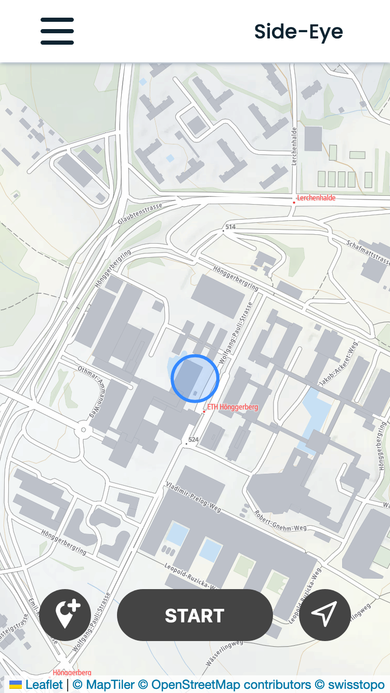

# SIDE-EYE

## Introduction
Side-Eye is a semesterproject in the lecture *GTA - Geoinformationstechnologien und -analysen* from Carlos Hunziker, Christian Blaser, Estelle Zemp and Niklas Eckert.

The idea of this project was to implement an app, which allows the user to track a trip or rather their commute. After completing the tracking, the app will then show them what interesting places they passed and missed while they were on the go. Currently, the app only supports restaurants and places of worship in the city of zurich, but it could be extended to support other points of interest (POIs) as well.

## How to use the app?
The app is shared under the following url: [Side-Eye](https://n.ethz.ch/~cblase/gta/index.html). It's important that your device is connected to the ETH VPN when you are not inside the ETH network, otherwise the application will not work. Due to the implementation with a vercel-server you can use all functionalities through the website (no need to use localhost). As default-data there are two pre-recorded example-trips you can test the app with. Alternatively, you can go out and explore the city of zurich by recording new trips on the maps-page. As soon as you start recording you'll see a blinking red dot appear in the upper right corner of your screen.

If you see something remarkable you want to be able to find again easily, you can mark points in tracking mode. Later in the visualisation of your trips, these points will be marked and help you to identify which POIs you spotted and wanted to remember.

The following images show the map-page in default- and in tracking mode.

  
  

After pressing the stop-button, a window pops up in which you can enter the name and transport mode of your trip and upload it to the database. 

Now you can switch from the map-page to your commutes, where you should see your newly recorded trip. After clicking on your trip, you can choose if you would like to see the restaurants or places of worship along your route. This is visualized in the screenshot below.

  
  

Now you can relive your trip and all the sights you saw (or missed) along the way. ENJOY :)

  
  

## Software Structure

## Folderstructure Repository

### data_processing

This is exactly the same folder that is deployed to the vercel server. It contains the backend.py file which performs the buffer analysis of the trips and the linestring cleaning function, as well as the requirements and vercel settings.

### Database

The database folder contains the .csv files with the POI-data which were exported from OSM (OpenStreetMap). This data is stored in a postGIS-database. The script used to upload and modify the data can be found in the load_db.ipynb-file. The database itself was created in pgAdmin4 using the commands saved in table_creation.txt. The download of the .csv-files took place via overpass-turbo.eu, the query is saved in overpass-turbo_query.txt.

### website

The website folder contains all the HTML-, CSS- and JavaScript-files as well as the graphics used on the webapp.
